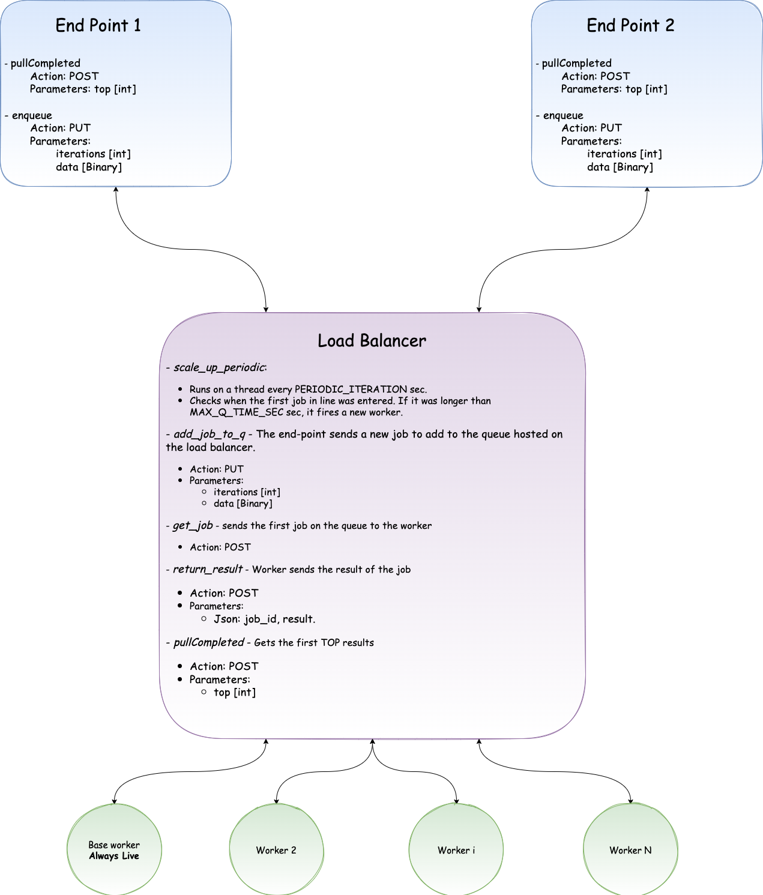

# Dynamic Workload
### A self implementation of a Dynamic Workload Manager.

---

## Abstract
In this project, I built a Dynamic Workload Manager that handles the load of requests by firing up new 
worker nodes. It is based solely on AWS services while only using EC2 services. The cluster is fired from 
a single bash script and is adopted based on the user's AWS configurations.

## Architecture
My cluster has three main components:
1. End-point - gets the user's requests and sends them to the load balancer.
2. Load balancer - the machine that handles the jobs and requests. Can scale up the workload based on predefined logical rules.
3. Worker - the machine that executes the job. Constantly requests jobs from the load balancer. Once no job is received after a certain period, the worker is self terminated.

## Usage
To fire the cluster, follow these steps from your CLI:
1. `cd <path-host-project>`
2. `git clone https://github.com/nirbarazida/dynamic-workload.git`
3. `cd dynamic-workload`
4. `fire_cluster/fire_cluster_main.sh` 

### Test
1. Create a test file by running the following command: `head -c 100 /dev/urandom > test_file`
2. PUT: send a jub: `curl http://<endpoint-public-ip>:5000/enqueue?iterations=10" -F "data=<path-to-test_file>" -X PUT`
3. POST: get the top 10 results': `curl http://<endpoint-public-ip>:5000/pullCompleted?top=10" -X POST`

## Prerequisites:
1. AWS CLI.
2. Bash

## Failure Modes & Solutions

### Overload
When my servers are swallowed with requests (e.g., during pick hours, bot attacks, etc.),   the request queue can get 
too long, resulting in a slower response time. The two most common ways of handling this are to turn away requests 
when the server is too busy or handle each request slower. 

### Software Failure
In this exercise, I wasn't required to deal with edge cases, therefore, my application might fail due to bad requests, 
wrong input, and many more reasons. If it was a production system, I'd have research for edge cases and cover them. 
Moreover, I'd test my code before deployment and if possible, have a QA engineer test it.

### Hardware Failure
Hardware can be tricky, especially when using cloud providers, and can be defected for many reasons, such as abuse, 
mechanical defect, electronic defect, earthquakes, and many more. To overcome hardware failures, I need to have a 
backup for all the components in the cluster, including the database that is currently hosted locally and should be 
hosted and replicated on different machines. Moreover, I need to have a heartbeat that checks that all machines are working and, if necessary, fire a replacement.

### Network Failure
Network failures can happen for the same reasons as mentioned in the hardware section. Those failures can result in the loss of request, e.g.:
1. Deleting a job from the queue before getting the request back.
2. Uploading/downloading only part of the data.

I'd resolve those issues by keeping the requests and results in a database outside the cluster. However, if a request 
fails before hitting the end-point, I don't really have a lot to do.

### Security
**Cyber Cyber Cyber**
I put in A LOT of work not to move the user's credentials to any of the machines. However, I'm sure my system has 
security breaches I'm not aware of. I'd definitely take a consultant in this case because it's too far away from my domain.
